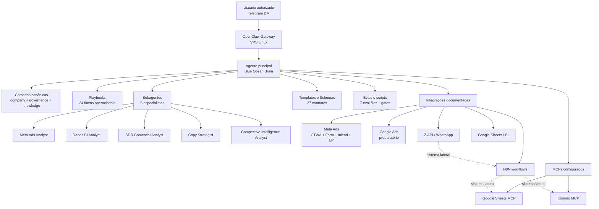

# 🌊🧠 Blue Ocean Brain

*Sistema multi-agente para escalar operações de marketing B2B SaaS via OpenClaw.*


## 2. Sumário

- [3. Visão geral](#3-visão-geral)
- [4. Por que existe](#4-por-que-existe)
- [5. Arquitetura](#5-arquitetura)
- [6. Estrutura do repositório](#6-estrutura-do-repositório)
- [7. Instalação e setup](#7-instalação-e-setup)
- [8. Uso](#8-uso)
- [9. Skills, knowledge e rules](#9-skills-knowledge-e-rules)
- [10. Integrações MCPs](#10-integrações-mcps)
- [11. Operação e manutenção](#11-operação-e-manutenção)
- [12. Evals e qualidade](#12-evals-e-qualidade)
- [13. Roadmap](#13-roadmap)
- [14. Contribuição](#14-contribuição)
- [15. Licença e contato](#15-licença-e-contato)

## 3. Visão geral

O **Blue Ocean Brain** é o repositório canônico do agente operacional da Blue Ocean SEM no OpenClaw. Ele organiza contexto, governança, playbooks, subagentes, templates, schemas, integrações e evals para diagnóstico e decisão em marketing B2B SaaS.

O sistema foi construído para operar em uma VPS Linux com OpenClaw, conectando canal conversacional, CRM, BI, automações e fontes de mídia. Ele reduz ambiguidade operacional em temas como CPL real, Lead Fantasma, qualidade comercial, attribution gap, performance de SDR e governança de decisão.

## 4. Por que existe

A operação da Blue Ocean depende de múltiplas fontes de verdade: Meta Ads, Google Ads em preparação, Kommo, Google Sheets, N8N, Z-API, SDRs e dashboards derivados. Sem uma camada canônica, análises misturam lead de plataforma com lead real, atribuição com avanço comercial e hipótese com fato.

O agente padroniza análises, acelera rotinas de diagnóstico e aumenta consistência operacional entre mídia, comercial e dados. Ele também protege decisões contra confiança inflada, dados contaminados, falta de owner e automações quebradas.

## 5. Arquitetura

### Diagrama



### Componentes

| Nome | Tipo | Modelo | Papel |
|---|---|---:|---|
| OpenClaw Gateway | Runtime | — | Recebe mensagens, aplica políticas de canal e roteia para o agente. |
| Agente principal | Agente OpenClaw | `openai-codex/gpt-5.5` | Orquestra contexto, playbooks, subagentes, MCPs e resposta final. |
| Fallback LLM | Modelo alternativo | `openai-codex/gpt-5.1-codex-mini` | Entra quando o modelo principal falha ou fica indisponível. |
| `AGENTS.md` | Instrução operacional | — | Define fluxo obrigatório, governança e uso das camadas. |
| `SOUL.md` | Persona | — | Define tom, postura e padrão de resposta do brain. |
| `MEMORY.md` | Memória estrutural | — | Guarda decisões duráveis e convenções estáveis. |
| `TOOLS.md` | Notas locais | — | Guarda detalhes práticos do ambiente sem segredos versionados. |
| `subagents/` | Especialistas | — | Separa leitura por domínio operacional. |
| `playbooks/` | Procedimentos | — | Converte perguntas recorrentes em fluxos reproduzíveis. |
| `evals/` | Qualidade | — | Testa regressões semânticas e red lines operacionais. |

### Integrações e MCPs

| Nome | Tipo | Função |
|---|---|---|
| Google Sheets MCP | Storage / BI | Lê e atualiza planilhas, sheets e múltiplos ranges autorizados. |
| Kommo MCP | CRM | Consulta e atualiza leads, contatos, empresas, tarefas, notas, calls e pipelines. |
| Telegram | Canal | Canal conversacional ativo para interação direta com o agente. |
| Meta Ads | Ads | Diagnóstico de CTWA, Form, Inlead, LP, criativos, CPL e qualidade. |
| Google Ads | Ads | Camada preparatória para diagnóstico e expansão futura. |
| N8N | Automation | Workflows de CTWA, CPL real, webhooks, buffers e sincronização. |
| Z-API / WhatsApp | Messaging / Automation | Apoia rota CTWA, Salesbot e distinção Lead Real vs Lead Fantasma. |
| Apify | Competitive intelligence | Apoia coleta estruturada quando aplicável. |

## 6. Estrutura do repositório

Inspeção realizada em `/root/.openclaw/repos/blueocean-brain-openclaw`. Contagens ignoram `.git` e consideram arquivos versionáveis.

```text
blueocean-brain-openclaw/
├─ company/                 — 5 arquivos: identidade, ICP, ofertas e glossário
├─ governance/              — 8 arquivos: decisão, confiança, ownership e red lines
├─ knowledge/               — 23 arquivos: contexto, benchmarks, padrões e workflows
│  ├─ benchmarks/           — benchmarks operacionais
│  ├─ company-brain/        — fonte de verdade e camada executiva
│  ├─ competitive-intelligence/ — frameworks competitivos
│  ├─ copy/                 — frameworks de copy
│  ├─ crm/                  — reservado para conhecimento CRM
│  ├─ matrices/             — matrizes de governança
│  ├─ paid-traffic/         — reservado para tráfego pago
│  ├─ patterns/             — padrões diagnósticos
│  └─ workflows/            — rotinas operacionais
├─ playbooks/               — 24 arquivos: fluxos operacionais canônicos
├─ subagents/               — 6 arquivos: README + 5 especialistas
├─ integrations/            — 21 arquivos: MCPs, Kommo, Sheets, Meta, N8N e CTWA
│  └─ validation/           — registros sanitizados de validações vivas
├─ templates/               — 17 arquivos: outputs, handoffs e snapshots
├─ schemas/                 — 10 arquivos: contratos profundos de análise
├─ evals/                   — 7 arquivos: evals semânticos e manifesto
├─ history/                 — 3 arquivos: evidência curada e sanitizada
├─ projects/                — 2 arquivos: blueprints estruturais
├─ security/                — 2 arquivos: checklist e política pré-commit
├─ scripts/                 — 2 arquivos: harness e safety scanner
├─ archive/                 — 0 arquivos: reservado para arquivo morto
├─ reports/                 — 0 arquivos: reservado para relatórios sanitizados
├─ sessions/                — 0 arquivos: reservado para sessões sanitizadas
└─ snapshots/               — 0 arquivos: reservado para snapshots sanitizados
```

## 7. Instalação e setup

### Pré-requisitos

| Item | Versão ou status inspecionado |
|---|---|
| OpenClaw | `2026.4.25+` |
| Node.js | `v22.22.2` |
| Sistema | VPS Linux |
| Canal ativo | Telegram |
| LLM primary | `openai-codex/gpt-5.5` |
| LLM fallback | `openai-codex/gpt-5.1-codex-mini` |
| MCPs ativos | Google Sheets, Kommo |

### Passo a passo

```bash
git clone https://github.com/Glemnt/blueocean-brain-openclaw.git
cd blueocean-brain-openclaw
```

```bash
# Documentação oficial: https://docs.openclaw.ai
npm install -g openclaw
openclaw configure
```

```bash
# Validar instalação local
openclaw --version
openclaw doctor
```

### Configuração principal

O repositório não contém `openclaw.json`, `agent.json` ou equivalente local. A instalação inspecionada usa configuração ativa em `/root/.openclaw/openclaw.json`, com workspace padrão em `/root/.openclaw/workspace`.

### Credenciais necessárias

| Domínio | Credencial | Onde configurar |
|---|---|---|
| LLM | OAuth/API key do provedor | Configuração local do OpenClaw |
| Telegram | Bot token | Configuração local do canal |
| Google Sheets | Service account JSON e Drive folder autorizado | MCP Google Sheets |
| Kommo | Base URL e token local | MCP Kommo |
| N8N | URL e API key | Ambiente N8N |
| Z-API | Instância e token local | Ambiente de automação |
| Meta Ads | Token e conta de anúncio | Ambiente de mídia / integração |
| Google Ads | Customer ID e credenciais | Preparatório |

### Primeiro start

```bash
openclaw gateway start
openclaw doctor
```

## 8. Uso

### Como interagir com o agente

| Canal | Status | Uso |
|---|---|---|
| Telegram DM | Ativo | Canal direto autorizado para falar com o agente. |
| WhatsApp | Não ativo na configuração inspecionada | Documentado como rota operacional via Z-API/CTWA, não como canal OpenClaw ativo. |
| Web/TUI local | Disponível via OpenClaw CLI | Útil para operação local e diagnóstico. |

### Slash commands principais

| Comando | Uso principal |
|---|---|
| `/status` | Ver modelo, runtime, contexto, uso e estado da sessão. |
| `/help` | Ver ajuda curta de comandos. |
| `/commands` | Listar catálogo de comandos disponíveis. |
| `/model` | Ver ou trocar modelo da sessão. |
| `/reasoning` | Alternar visibilidade de reasoning quando suportado. |
| `/compact` | Compactar contexto da sessão. |
| `/new` | Criar nova sessão. |
| `/stop` | Interromper execução atual. |
| `/subagents` | Gerenciar subagentes da sessão. |
| `/tasks` | Listar tarefas em background. |

### Prompts úteis

```text
Analise a performance diária das campanhas Meta Ads. Separe CPL de plataforma, Lead Real, Lead Fantasma, avanço comercial e recomendação com nível de confiança.
```

```text
Faça um diagnóstico dos SDRs Brunno Vaz, Andrey, Vinicius Meireles e Gabriel Valadares. Compare SLA, volume, conversão, no-show e perdas por motivo, sem tratar hipótese como fato.
```

```text
Faça uma análise competitiva de 3 concorrentes B2B SaaS. Compare proposta, landing page, criativos, oferta, prova e ângulo de copy. Entregue oportunidades acionáveis para Blue Ocean SEM.
```

## 9. Skills, knowledge e rules

| Camada | Contagem real | Status | Descrição |
|---|---:|---|---|
| `skills/` | 0 | Não existe no repo | Não há skills OpenClaw versionadas aqui; o uso atual está em playbooks, subagentes e comandos nativos. |
| `knowledge/` | 23 | Ativa | Contexto de negócio, benchmarks, padrões, matrizes, workflows, copy e inteligência competitiva. |
| `rules/` | 0 | Não existe no repo | Regras vivem em `AGENTS.md`, `governance/`, `security/` e `SOUL.md`. |
| `templates/` | 17 | Ativa | Outputs, handoffs, relatórios, snapshots, planos e formatos de resposta. |
| `prompts/` | 0 | Não existe no repo | A instrução principal está em `AGENTS.md` e a persona em `SOUL.md`. |
| `hooks/` | 0 | Não existe no repo | Hooks não estão versionados neste repositório. |
| `workflows/` | 4 | Em `knowledge/workflows/` | Checklists e rotinas operacionais documentadas. |

Índices existentes: `REPO_INDEX_BY_QUESTION.md`, `OPERATOR_GUIDE.md`, `knowledge/README.md`, `templates/README.md`, `evals/eval-manifest.md`.

## 10. Integrações MCPs

### MCPs configurados

| Nome | Tipo | Status | Como configurar credencial |
|---|---|---|---|
| Google Sheets | Storage / BI | Configurado no OpenClaw | Usar service account local protegida, Drive folder autorizado e tools permitidas no MCP. |
| Kommo | CRM | Configurado no OpenClaw | Usar runner local do MCP Kommo e token/base URL fora do git. |

### Integrações documentadas

| Nome | Tipo | Status | Como configurar credencial |
|---|---|---|---|
| Telegram | Canal | Ativo | Configurar bot token no OpenClaw, nunca no repo. |
| Meta Ads | Ads | Documentado | Configurar token/conta de anúncio em ambiente seguro. |
| Google Ads | Ads | Preparatório | Configurar customer ID e credenciais quando ativar operação. |
| N8N | Automation | Documentado | Configurar URL, API key e webhooks fora do git. |
| Z-API / WhatsApp | Messaging | Documentado | Configurar instância e token no ambiente de automação. |
| Apify | Data collection | Documentado | Configurar credencial apenas se usado em inteligência competitiva. |

### Como adicionar um novo MCP

1. Defina função, owner, credenciais necessárias e dados que o MCP pode acessar.
2. Configure o servidor em `openclaw.json` pelo fluxo OpenClaw, sem versionar tokens.
3. Documente contrato, limites e fonte de verdade em `integrations/`.
4. Crie validação viva em `integrations/validation/` quando houver prova real.
5. Rode `openclaw doctor` e os gates locais antes de usar em produção.

## 11. Operação e manutenção

### Atualização

```bash
openclaw update status
openclaw update --dry-run
openclaw update
```

Use `--dry-run` antes de atualizar. Evite atualizar durante análise crítica, automação ativa ou sessão com estado importante sem backup.

### Backup

| Item | Periodicidade sugerida | Observação |
|---|---|---|
| Repositório git | A cada alteração relevante | Commit e push após validação. |
| `/root/.openclaw/openclaw.json` | Antes de mudanças de config | Contém configuração local; proteger segredos. |
| Credenciais MCP/canais | Antes de rotação | Nunca versionar no repo. |
| `memory/` operacional | Diário ou antes de compaction | Preserva continuidade entre sessões. |
| Backups OpenClaw | Semanal | Usar `openclaw backup` quando apropriado. |

### Troubleshooting comum

| Problema | Checklist |
|---|---|
| Gateway não sobe | Encerrar processo zumbi, checar porta, validar systemd user e rodar `openclaw gateway status`. |
| Plugins corrompidos | Rodar `openclaw doctor --fix` e revisar warnings antes de reiniciar. |
| Bot mudo | Checar canal, versão OpenClaw, token local e considerar `openclaw update --dry-run`. |
| Modelo LLM falhando | Rodar `/status`, verificar provider, auth e fallback configurado. |

### Comandos diagnósticos essenciais

```bash
openclaw doctor
openclaw gateway status
journalctl --user -u openclaw-gateway.service -n 100 --no-pager
```

## 12. Evals e qualidade

### Como rodar testes locais

```bash
python3 scripts/eval_harness.py
python3 scripts/repo_safety_scan.py
git diff --check
```

### Score atual

| Métrica | Valor inspecionado |
|---|---:|
| Evals estruturais | 7 arquivos |
| Cenários validados | 20 cenários |
| Safety scan | OK |
| Links internos quebrados | 0 |
| Referências markdown quebradas | 0 |
| Score numérico formal | Não existe registro versionado |

### Métricas-chave monitoradas

| Métrica | Onde aparece |
|---|---|
| CPL de plataforma vs CPL real | Meta Ads, Kommo, Sheets e dashboards derivados |
| Lead Real vs Lead Fantasma | CTWA, Kommo e planilha WhatsApp |
| SLA e conversão SDR | Playbooks e evals comerciais |
| Confiança da recomendação | Governance e templates |
| Red line testada | Evals e decision framework |

## 13. Roadmap

Esta seção é mantida manualmente — atualize ao concluir itens.

### Próximas evoluções

| Item | Status |
|---|---|
| TODO: validar MCP Google Sheets com prova viva versionada em `integrations/validation/`. | Pendente |
| TODO: validar MCP Kommo com prova viva sanitizada. | Pendente |
| TODO: formalizar ativação Google Ads quando a operação sair do preparatório. | Pendente |
| TODO: definir score numérico formal do agente, se necessário. | Pendente |

### Pendências conhecidas

| Item | Status |
|---|---|
| TODO: inserir site oficial da Blue Ocean SEM na seção de contato. | Pendente |
| TODO: confirmar política final de licença caso deixe de ser MIT. | Pendente |
| TODO: documentar rotina real de backup após definição operacional. | Pendente |

## 14. Contribuição

### Como propor mudanças

1. Localize a camada correta pelo `REPO_INDEX_BY_QUESTION.md`.
2. Edite o menor conjunto de arquivos possível.
3. Evite duplicar regra global fora de `governance/` ou `AGENTS.md`.
4. Não versionar secrets, PII, exports brutos, payloads reais ou cache.
5. Rode os gates locais antes de commit.

### Convenções de nomenclatura

| Tipo | Convenção observada |
|---|---|
| Arquivos markdown | `kebab-case` com extensão Markdown |
| Playbooks | Nome por tarefa operacional |
| Subagentes | Sufixo `-analyst` ou papel especialista |
| Templates | Nome do output ou handoff |
| Schemas | Nome do contrato de dados/análise |
| Evals | Nome do domínio testado |

### Validação antes de commit

```bash
python3 scripts/eval_harness.py
python3 scripts/repo_safety_scan.py
git diff --check
git status --short
```

## 15. Licença e contato

| Campo | Valor |
|---|---|
| Licença | MIT, conforme `LICENSE` versionado. |
| Empresa | Blue Ocean SEM |
| Owner técnico | Guilherme, CEO Blue Ocean SEM |
| Repositório | https://github.com/Glemnt/blueocean-brain-openclaw |
| Site da empresa | TODO: inserir site oficial da Blue Ocean SEM |

Se a licença operacional desejada for proprietária, atualize primeiro o arquivo `LICENSE` e depois esta seção para evitar contradição documental.
