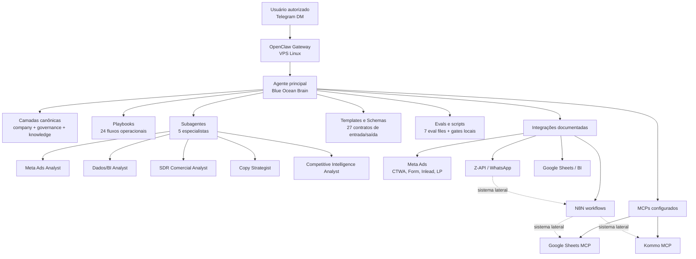

# 🌊🧠 Blue Ocean Brain

*Sistema multi-agente para escalar operações de marketing B2B SaaS via OpenClaw.*


## Sumário

- [Visão geral](#visão-geral)
- [Por que existe](#por-que-existe)
- [Arquitetura](#arquitetura)
  - [Diagrama](#diagrama)
  - [Componentes](#componentes)
  - [Integrações e MCPs](#integrações-e-mcps)
- [Estrutura do repositório](#estrutura-do-repositório)
- [Instalação e setup](#instalação-e-setup)
  - [Pré-requisitos](#pré-requisitos)
  - [Passo a passo](#passo-a-passo)
  - [Variáveis e credenciais](#variáveis-e-credenciais)
  - [Primeiro start e validação](#primeiro-start-e-validação)

## Visão geral

O **Blue Ocean Brain** é o repositório canônico do agente operacional da Blue Ocean SEM no OpenClaw. Ele organiza conhecimento, governança, playbooks, subagentes, templates, schemas, integrações e evals para operar diagnósticos e decisões em marketing B2B SaaS.

Foi construído para a operação da aceleradora de marketing B2B SaaS da Blue Ocean no Brasil, com foco em previsibilidade de aquisição, qualidade de lead, rastreabilidade comercial e consistência de execução. O sistema roda em **OpenClaw** em uma VPS Linux e atua como camada de inteligência entre canais conversacionais, dados operacionais, CRM, BI e automações.

## Por que existe

A operação da Blue Ocean depende de múltiplas fontes de verdade: Meta Ads, Google Ads em preparação, Kommo, Google Sheets, N8N, Z-API, SDRs e dashboards derivados. Sem uma camada canônica, análises tendem a misturar CPL de plataforma com lead real, atribuição com avanço comercial, hipótese com fato e ruído de stack com problema de performance.

Este repositório existe para padronizar decisões, automatizar análises recorrentes, escalar a consistência operacional dos SDRs e proteger a governança de dados. O objetivo é transformar diagnóstico, forecast, reconciliação, auditoria de funil, handoff e priorização em rotinas reproduzíveis, auditáveis e seguras.

## Arquitetura

### Diagrama



### Componentes

| Nome | Tipo | Modelo | Papel |
|---|---|---:|---|
| OpenClaw Gateway | Runtime / gateway | — | Recebe mensagens, aplica políticas de canal e roteia para o agente. |
| Agente principal | Agente OpenClaw | `openai-codex/gpt-5.5` | Orquestra leitura, decisão, playbooks, subagentes, integrações e respostas. |
| Fallback LLM | Modelo de contingência | `openai-codex/gpt-5.1-codex-mini` | Modelo alternativo configurado para fallback do agente. |
| `AGENTS.md` | Configuração operacional do agente | — | Define fluxo obrigatório de demandas Blue Ocean, governança e uso das camadas. |
| `SOUL.md` | Persona operacional | — | Define tom, postura e estilo do brain. |
| `MEMORY.md` | Memória canônica | — | Guarda decisões estruturais, convenções e aprendizados duradouros. |
| `TOOLS.md` | Notas locais | — | Espaço para detalhes de ambiente e acesso sem versionar segredos. |
| `company/` | Contexto de negócio | — | Identidade, ICP, ofertas, tickets e glossário. |
| `governance/` | Regras e alçadas | — | Confiança, decisão, ownership, red lines e política de evidência. |
| `knowledge/` | Base de conhecimento | — | Benchmarks, padrões, matrizes, workflows, CRM, copy e inteligência competitiva. |
| `playbooks/` | Fluxos operacionais | — | 24 procedimentos para diagnóstico, forecast, reconciliação, reporting e governança. |
| `subagents/` | Especialistas | — | 5 subagentes por domínio operacional. |
| `templates/` | Contratos leves | — | 17 formatos de saída, handoff e status. |
| `schemas/` | Contratos profundos | — | 10 schemas para entradas e análises recorrentes. |
| `evals/` | Testes semânticos | — | 7 arquivos de eval com 20 cenários validados pelo harness local. |
| `scripts/` | Ferramentas locais | — | Harness de evals e scanner de segurança pré-commit. |

### Integrações e MCPs

| Nome | Tipo | Função |
|---|---|---|
| Google Sheets MCP | MCP configurado | Leitura/escrita controlada em planilhas, listagem de sheets e múltiplos ranges. |
| Kommo MCP | MCP configurado | Consulta e atualização operacional de leads, contatos, empresas, tarefas, notas, calls e pipelines. |
| Telegram | Canal OpenClaw ativo | Canal conversacional direto autorizado para operação do agente. |
| Meta Ads | Integração documentada | Diagnóstico de mídia, CTWA, Form, Inlead, LP, criativos, CPL e qualidade de lead. |
| Google Ads | Integração preparatória | Camada de diagnóstico e planejamento para expansão futura. |
| N8N | Automação externa documentada | Workflows de CTWA, CPL real, buffers, webhooks e sincronização operacional. |
| Z-API / WhatsApp | Automação externa documentada | Rota WhatsApp/CTWA, Salesbot e apoio à distinção Lead Real vs Lead Fantasma. |
| Google Sheets / BI | BI operacional | Camada de reconciliação, dashboards, reporting comercial e métricas derivadas. |
| Apify | Integração documentada | Apoio a coleta/estruturação em inteligência competitiva quando aplicável. |

## Estrutura do repositório

Inspeção realizada na raiz do repositório em `/root/.openclaw/repos/blueocean-brain-openclaw`. Contagens abaixo consideram arquivos versionáveis e ignoram `.git`.

```text
blueocean-brain-openclaw/
├─ company/                 — 5 arquivos: identidade, ICP, ofertas e glossário
├─ governance/              — 8 arquivos: princípios, decisão, confiança, ownership e red lines
├─ knowledge/               — 23 arquivos: contexto, benchmarks, padrões, matrizes e workflows
│  ├─ benchmarks/           — benchmarks operacionais
│  ├─ company-brain/        — regras de verdade e camada executiva
│  ├─ competitive-intelligence/ — frameworks e referência competitiva
│  ├─ copy/                 — frameworks de copy
│  ├─ crm/                  — reservado para conhecimento CRM
│  ├─ matrices/             — matrizes de governança e ownership
│  ├─ paid-traffic/         — reservado para tráfego pago
│  ├─ patterns/             — padrões diagnósticos e sazonalidade
│  └─ workflows/            — rotinas operacionais recorrentes
├─ playbooks/               — 24 arquivos: fluxos operacionais canônicos
├─ subagents/               — 6 arquivos: README + 5 especialistas
├─ integrations/            — 21 arquivos: MCPs, Kommo, Sheets, Meta, N8N, CTWA e validação
│  └─ validation/           — registros sanitizados de validações vivas
├─ templates/               — 17 arquivos: outputs, handoffs, snapshots e formatos de resposta
├─ schemas/                 — 10 arquivos: contratos profundos para análises recorrentes
├─ evals/                   — 7 arquivos: evals semânticos e manifesto
├─ history/                 — 3 arquivos: evidência curada, sanitizada e datada
├─ projects/                — 2 arquivos: blueprints estruturais de projeto
├─ security/                — 2 arquivos: checklist e política prática pré-commit
├─ scripts/                 — 2 arquivos: eval harness e safety scanner
├─ archive/                 — 0 arquivos: reservado para material arquivado sem operação ativa
├─ reports/                 — 0 arquivos: reservado para relatórios sanitizados
├─ sessions/                — 0 arquivos: reservado para sessões sanitizadas quando necessário
└─ snapshots/               — 0 arquivos: reservado para snapshots sanitizados quando necessário
```

Arquivos operacionais na raiz:

- `AGENTS.md` — instruções canônicas do agente.
- `SOUL.md` — tom e postura do brain.
- `MEMORY.md` — memória estrutural de longo prazo.
- `TOOLS.md` — notas locais de operação.
- `OPERATOR_GUIDE.md` — guia de uso do repositório.
- `REPO_INDEX_BY_QUESTION.md` — índice por pergunta operacional.
- `.gitignore` — exclusões de segurança e ruído.
- `LICENSE` — licença do projeto.

## Instalação e setup

### Pré-requisitos

- VPS Linux com acesso SSH seguro.
- Node.js `v22.22.2` ou compatível com a versão atual do OpenClaw.
- OpenClaw `2026.4.25+`.
- Conta/provedor LLM configurado no OpenClaw.
- Conta Telegram Bot para canal conversacional, se for usar Telegram.
- Credenciais de Google Sheets via service account.
- Credenciais Kommo com permissões adequadas.
- Contas e acessos operacionais Meta Ads, Google Ads, Kommo, Google Sheets, N8N e Z-API conforme o escopo de automação.

### Passo a passo

1. Clone o repositório:

```bash
git clone https://github.com/Glemnt/blueocean-brain-openclaw.git
cd blueocean-brain-openclaw
```

2. Instale e configure o OpenClaw seguindo a documentação oficial:

```bash
# Documentação oficial
# https://docs.openclaw.ai

npm install -g openclaw
openclaw configure
```

3. Garanta que o workspace do OpenClaw aponte para o ambiente operacional correto.

Na instalação inspecionada, a configuração ativa fica em:

```bash
/root/.openclaw/openclaw.json
```

E o workspace padrão configurado é:

```bash
/root/.openclaw/workspace
```

4. Configure MCPs e credenciais.

MCPs identificados na configuração ativa:

```text
google-sheets
kommo
```

Exemplo conceitual de configuração esperada para Google Sheets:

```bash
# Caminho esperado para service account na instalação inspecionada
/etc/blueocean-mcp/google-service-account.json

# Ferramentas habilitadas no MCP Google Sheets
list_spreadsheets,list_sheets,get_sheet_data,update_cells,get_multiple_sheet_data
```

Exemplo conceitual para Kommo:

```bash
# Runner local identificado na instalação inspecionada
/root/.openclaw/workspace/mcp-investigation/kommo-mcp/run_kommo_mcp.sh
```

5. Configure canal Telegram no OpenClaw, se aplicável.

A instalação inspecionada possui Telegram ativo como canal direto. Não versionar `botToken`, IDs sensíveis ou tokens no repositório.

### Variáveis e credenciais

Não versionar segredos. Use variáveis de ambiente, arquivos locais protegidos ou secret managers.

Credenciais necessárias por domínio:

```text
LLM / OpenClaw:
- perfil OAuth ou API key do provedor configurado no OpenClaw

Telegram:
- bot token local, nunca versionado

Google Sheets MCP:
- SERVICE_ACCOUNT_PATH apontando para o JSON local protegido
- DRIVE_FOLDER_ID do Drive autorizado
- ENABLED_TOOLS com as ferramentas liberadas

Kommo MCP:
- base URL da conta Kommo
- token OAuth/API local, nunca versionado

Automações externas:
- URL/API key do N8N
- credenciais Z-API locais

Plataformas de mídia:
- token Meta Ads local
- ID da conta de anúncios Meta
- customer ID Google Ads quando a operação estiver ativa
```

> Os nomes acima são referência operacional. A forma final depende do MCP, workflow ou plugin usado no ambiente.

### Primeiro start e validação

Inicie o gateway e valide a instalação:

```bash
openclaw gateway start
openclaw doctor
```

Verifique a versão do OpenClaw:

```bash
openclaw --version
```

Rode os gates locais do repositório antes de qualquer alteração relevante:

```bash
python3 scripts/eval_harness.py
python3 scripts/repo_safety_scan.py
git diff --check
```

Resultado esperado na versão inspecionada:

```text
OK: 7 eval files, 20 scenarios
OK: no raw files, obvious secrets, or unapproved PII patterns detected
```
